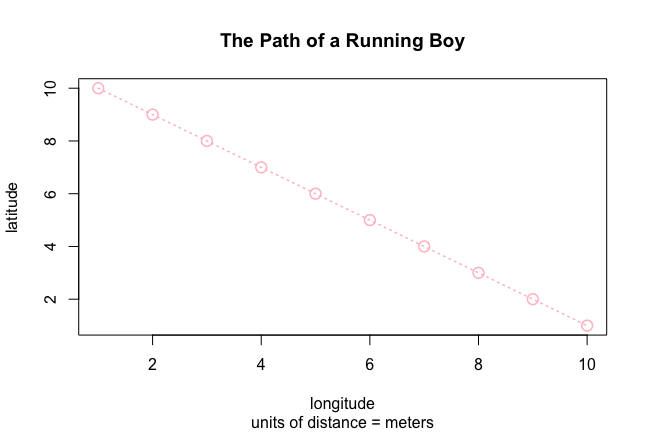

[Back to Home Page](https://grace-yoon1.github.io/wicked_problems/)

### The Path of a Running Boy

In this exercise, I created vector and data frame objects, used the sample function, and generated a plot using circles and lines.

---
### A Person's path between Homes

In this exercise, I created a plot with vector and data frame objects to place 10 squares and 10 circles randomly. I explored the sample function to select 3 dwellings for the person to travel between. Each of the 3 dwellings are labeled with the text function and are connected using the xspline function.

---
### Challenge Question

In this challenge exercise, I placed 50 squares, 40 circles, and 12 large trees randomly throughout the 1000 x 1000 dimensioned area. I selected 7 random dwellings out of the 50 total for the person to move through and used the xspline function to connect those dwellings into a path.
