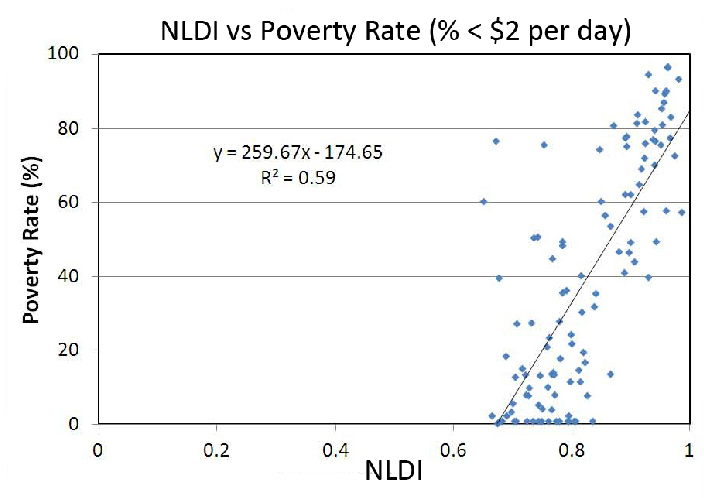

[Back to Home Page](https://grace-yoon1.github.io/DATA150/)

Grace Yoon

COLL 150 Human Development and Data Science

Professor Brewer

21 November 2021

Word count: 1656

---

### Methodological Investigation: Poverty Assessment and Analysis in India

---

#### Introduction to Solving the Poverty Crisis in India through Geospatial and Satellite Data

Poverty is a significant harm to countries all over the world. It causes millions of humans to face challenges like poor health and untenable living conditions. They are unable to fulfill their basic needs and capabilities to survive due to the lack of resources, goods, and services (Fashridjal). To reduce the amount of poverty in the world, researchers have tried numerous approaches, however, the issue is not knowing exactly where in these countries that individuals suffer from poverty the most. Without knowing these areas of poverty, development in these countries is slowed down, not allowing them to attain the freedoms to allow them to thrive. To find specific areas of poverty, data science methods using geospatial and satellite data can be used to spatially target and estimate poverty in these underdeveloped countries (Bill and Melinda Gates Foundation, World). 

Methods to alleviate poverty around the world are described in all of the articles I’ve researched. From using traditional methods such as data collection from surveys to utilizing technology, such as convolutional nueral networks, to explore data, there is one common objective: to eliminate poverty. I’ve learned that this can be achieved through observing poverty maps from satellite imagery data. Satellite data can be used to obtain information and create spatial datasets for poverty status in developing countries. It is important to use this effective approach frequently to track poverty accurately over time and provide the necessary resources in areas that need it, in order to live a life with basic capabilities, freedoms, and opportunities. 

In Amartya Sen’s “Development as Freedom,” Sen discusses how analyzing and assessing poverty can enhance the lives we lead and the freedoms we enjoy (Sen). Gathering data to find areas that are not as developed can allow us to use freedoms to further develop and remove the unfreedom of low income (Bill and Melinda Gates Foundation, World). Sen discusses how development is the process of expanding human freedoms and by obtaining information about these poorer areas, actions and policies can be made to allow these countries to reach this developmental freedom (Sen). In this methodological investigation, I will assess geospatial data science methods utilized to assess poverty, model relationships between variables, and analyze interactions to produce findings in alleviating poverty in a developing country: India. With this investigation, I hope to answer if poverty can be mapped and estimated accurately from satellite imagery at a closer neighborhood-level resolution to obtain more refined and precise predictions.

---

#### Data Sources, Data Collection, and Data Processing

Poverty is the scarcity of necessary resources in order to fulfill needs and capabilities. Lack of food, shelter, and clothing contributes to issues of healthcare, security, and education (Das). Unsurprisingly, poverty is in areas with larger populations that lack enough resources to gain financial security. To eradicate poverty, an exact poverty map is needed. In the developing world, there is a barrier to this goal due to unreliable and ineffective data collection. However, there is an alternative approach: mapping poverty using high-resolution satellite imagery along with survey data (Das). 

In this figure, the utilization of daytime satellite imagery vs. night time lights data is shown. This distribution of satellite imagery data displays that night time lights data is used significantly more for applications like poverty mapping. The Progress out of Poverty Index (PPI) can be used to create poverty maps that display the chance of individuals living in poverty for large geographic areas, such as those in India. It uses geolocated survey data and geospatial datasets to predict spatial poverty, which can be used to better understand where these areas are in order to further develop them (Bill and Melinda Gates Foundation, World). 

Data is essential to understanding a population’s situation to make the best informed decision in “resource allocation, poverty alleviation programs, and policies” (Bill and Melinda Gates Foundation. “High). Geospatial datasets and patterns of poverty have been built from census data, however, those datasets have been inaccurate due to irregular or unavailable data in these low-income areas (Bill and Melinda Gates Foundation. “High). Therefore, powerful machine learning techniques like poverty mapping allow us to understand complex human development problems from accurate data and reach the sustainable goal of locating areas in need, providing them freedoms in order to develop as a whole (Das).

In this figure, the authors provided a national level prediction map in Bangladesh using mobile phone operators and other data to closely access areas in poverty. The wealth index is color-coded, having areas in red shown as poorer areas. From these models, the spatial relationships in the data of these areas can be used to understand and update these maps, which is important for analyzing poorer areas to alleviate poverty (Bill and Melinda Gates Foundation. “High).

---

#### Data Science Methods: Combining Satellite Imagery and Machine Learning to Analyze Poverty

Reliable data is scarce in undeveloped countries, so methods like using high-resolution satellite imagery can be used to attain accurate data. A CNN is a model that can be used to identify and analyze variation patterns in these images. Using a CNN is critical for obtaining accurate measurements of poverty to make decisions about providing resources to areas that need it. CNNs know how to turn images into numerical values, which can be used to predict poverty. 

This formula is an example of how a CNN can take an image as an input and transform it into numerical values to predict a target.

Over the years, data in developing countries have improved, but it is still lacking, making it difficult to identify and analyze target populations in need. Sources of passively collected data from satellites can be a better option. A popular approach is using satellite images of nightlights to estimate poverty (Jean). 

In this figure, four different convolutional filters in CNNs have areas that activate it highlighted in pink. The top row has daytime satellite images, the second row contains filter activation maps, and both layered on top of each other are shown in the third row. The activation areas in this figure detects features from CNNs as roads, bodies of water, and infrastructure (Jean).

In impoverished countries, luminosity levels are lower because there is less infrastructure in those rural areas, while big cities are “bathed in light at night” and have a higher standard of living because they are generally more developed (Elvidge). Elvidge, and several other researchers, have developed a measurement of human development called “Night Light Development Index (NLDI)” by using nighttime satellite images and population density from gridded population data (Elvidge). In their study, they have found an interesting pattern from NLDI. The data points for extremely poor countries are pressed along the population count and have no spread on the brightness axis. In more developed countries with smaller populations, the data cloud is in a circular shape pressed against both the population count and the brightness of the lights in satellite images. Extracting and comparing patterns from data plots like these can determine the development level of countries (Elvidge). 

In this figure, a line of best fit is shown with the formula and correlation level. It shows that there is a strong correlation between the level of night time lights in satellite imagery and poverty rate (Elvidge).

Overall, this powerful machine learning approach of extracting data from nighttime satellite images and comparing the data points on scattergrams is a very effective approach to predicting poverty (Jean).

---

#### Applying Statistical Methods to Data to Assess and Analyze Poverty

There are several data science methods that I have found to be significant and interesting in assessing and analyzing poverty in areas like India. To alleviate poverty, data science strategies like creating computer vision models allow us to provide resources and predict poverty in countries. The article, “How to Understand Global Poverty from Outer Space,” discusses five key steps to approaching global poverty (Kumar). The author discusses a method to predict poverty using a CNN and uses daytime and nighttime satellite images to analyze certain areas in order to improve policy initiatives and alleviate poverty. The first step is to download Demographic and Health Surveys (DHS), nightlight satellite imagery, and daytime satellite imagery. The article discusses downloading data and constructing clusters to gain a better understanding and measurement for “health, population, and nutrition” (Kumar). 

They used the Google Maps Platform to obtain daytime images that have features of landscape and activity. Then, the next step is to test whether nightlights can predict wealth accurately. 

From the data collected, the DHS and nightlights data is merged to see if nightlights data can be used for predicting poverty. The author explains how creating this visualization shows that nightlight luminosity is a strong predictor of wealth. After, extracted features of the daytime imagery are tested. Daytime imagery can be a valuable tool as well and when merged with the DHS data, “a model of wealth as a function of these basic daytime features [can be] fitted” (Kumar). Next, a CNN is constructed to leverage a combined dataset of daytime and nighttime images. Lastly, maps are constructed to show the predicted distributions of wealth. In conclusion, an approach to predict poverty in areas is to use CNN with daytime and nighttime satellite imagery with survey data, which analyzes data in a scalable and inexpensive way (Kumar). 

---

#### Conclusion

I’ve learned that poverty can be eliminated through observing poverty maps from satellite imagery data and using CNNs. Satellite data can be used to obtain information and create spatial datasets for poverty status in developing countries. Using a trained CNN can take that data and predict the level of poverty in areas. It is important to use this effective approach frequently to track poverty accurately over time and provide the necessary resources in areas that need it, in order to live a life with basic capabilities, freedoms, and opportunities. 

In investigating if poverty can be mapped and estimated accurately from satellite imagery at a closer neighborhood-level resolution to obtain more refined and precise predictions, it appears that it has been neglected and left unanswered. All of the articles studied zoomed out satellite images of vast areas of land to predict and assess poverty in a country. However, I would like to investigate more on this research gap to see if the same approach could be applied with taking satellite imagery at neighborhood levels to estimate poverty. I am interested in exploring more from the analysis and research I’ve done in poverty in developing countries like India. 

---

#### Citations

Bill and Melinda Gates Foundation. “High Resolution Poverty Mapping from Cell Phone and Satellite Data.” WorldPop, https://www.worldpop.org/portfolio/project?id=23. Accessed 2 Oct. 2021. 

Bill and Melinda Gates Foundation, World Bank, Grameen Foundation. “High Resolution Progress out of Poverty Mapping.” WorldPop, https://www.worldpop.org/portfolio/project?id=22. Accessed 30 Sept. 2021.

Das, Partha Sarathi, et al. “Socio Economic Analysis of India with High Resolution Satellite Imagery to Predict Poverty.” 2020 10th International Conference on Cloud Computing, Data Science & Engineering (Confluence), 9 Apr. 2020, pp. 310–314., https://doi.org/10.1109/Confluence47617.2020.9057972. Accessed 23 Oct. 2021.

Elvidge, C. D., et al. “The Night Light Development Index (NLDI): a Spatially Explicit Measure of Human Development from Satellite Data.” Social Geography, 23 July 2012, Accessed 23 Oct. 2021.

Fashridjal, Freddy. “How Data Science Can Give Further Understanding on Urban Poverty.” Towards Data Science, 13AD, https://towardsdatascience.com/how-data-science-can-give-further-understanding-on-urban-poverty-ab52e448913.

Jean, Neal, et al. “Combining Satellite Imagery and Machine Learning to Predict Poverty.” American Association for the Advancement of Science, vol. 353, no. 6301, Aug. 2016, pp. 790–794., https://doi.org/https://doi.org/10.1126/science.aaf7894. Accessed 23 Oct. 2021.

Kumar, Asmi. “How to Understand Global Poverty from Outer Space.” Towards Data Science, 5 July 2020, https://towardsdatascience.com/how-to-understand-global-poverty-from-outer-space-442e2a5c3666. 

Satapathy, Swastik S, and Krishna K Jaiswal. “A Study on Poverty Estimation and Current State of Poverty in India.” International Journal of Advanced Scientific Research and Management, vol. 3, no. 6, June 2018, Accessed 23 Oct. 2021. 

Sen, A. K. (2010). Development as freedom. Oxford University Press.
