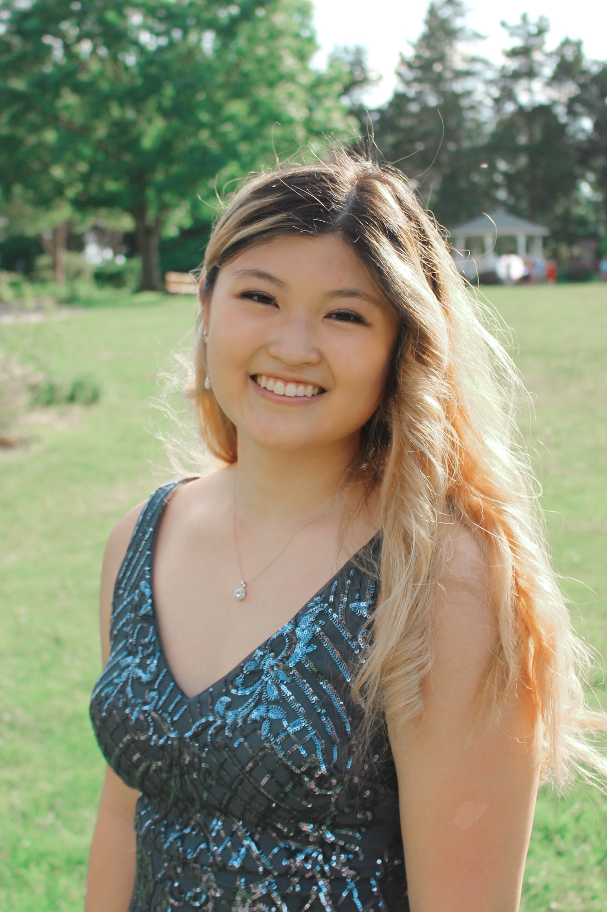

# Evolving Solutions: Human Development/Data Science 

### Grace Yoon 
#### *Computer Science Student at The College of William & Mary*  

---

### Introduction
My name is Grace Yoon and I am from Fairfax, VA. I am a freshman student at William & Mary and I plan to major in computer science because I enjoy learning different coding languages and data structures. I have experience in the field with volunteering as a java tutor and working at Code Ninjas, where I teach children ages 4-14 to code in JavaScript, Scratch, Lua, etc., and guide them to gain problem-solving and critical thinking skills. I plan on joining various CS related organizations, labs, and clubs here at William & Mary. I also participate in W&M's Wind Ensemble on bassoon! I love music and I have been involved in it for all of my life. My favorite and rewarding moments are leading my high school's marching band as the drum major and performing at the John F. Kennedy Center. I recently got a cockapoo and I enjoy exploring trails with him as well. This is a little bit about me and I am excited to learn data science in Human Development/Data Science!

---

### Informal Responses

- [Getting Started with R & RStudio](1.4.md)

- [9/7 - Joshua Blumenstock](Blumenstock.md)

- [9/9 - Hans Rosling](Rosling.md)

- [9/21 - Owen Barder](Barder.md)

- [9/23 - Gettysburg Address & Human Dev](Sept23Essay.md)

- [9/28 - Personal Statement](Sept28Essay.md)

- [9/30 - Gapminder](Sept30Gapminder.md)

- [10/7 - Our World in Data](Oct7Essay.md)

- [10/12 - China BRI](BRI.md)

- [10/21 - Data on Abundance](Oct21Essay.md)

- [10/28 - What is Data Science?](Oct28Essay.md)

- [11/2 - Human Development Index](Nov2Essay.md)

- [11/4 - Data Science/Human Development Topics](Nov4Essay.md)

- [11/9 - Facial Recognition Technology](Nov9Essay.md)

- [11/11 - ](Nov11Essay.md)

---

### Formal Writing Assignments

- [Annotated Bibliography](AnnotatedBibliography.md)

- [Literature Review](LitReview.md)

- [Methodological Investigation]()

- [Presentation]()

- [Research Proposal]()
